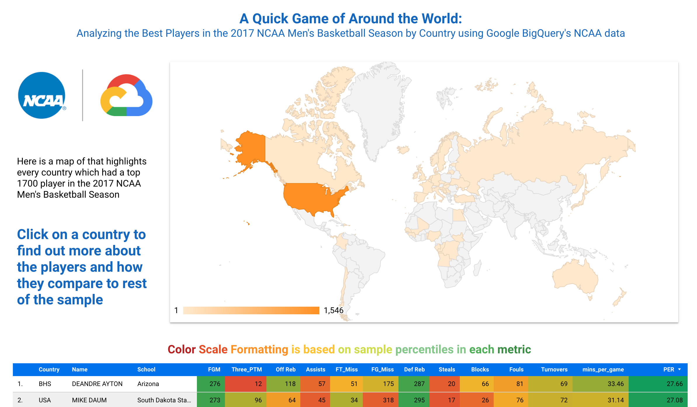

# NCAA March Madness Query

## TL;DR
- I used [Google’s NCAA Basketball Database](https://console.cloud.google.com/marketplace/details/ncaa-bb-public/ncaa-basketball)
to answer a seemingly simple question: *who are the best players from each country?*
- With the help of SQL and Python, I queried and calculated insights from the database
- I created [this Dashboard in Google Data Studio](https://datastudio.google.com/s/jAmFXmtW6nc) to visualize my work!

## Intro
Because I’m a huge college basketball fan, I wanted to play around with [Google’s NCAA Basketball Database](https://console.cloud.google.com/marketplace/details/ncaa-bb-public/ncaa-basketball)
that is located on Google Cloud’s Big Query Platform. The database includes stats about games, team, and players that date 
back all the way to 1894! Since the 2020 March Madness Tournament is cancelled due to COVID-19, I created this personal
project to keep me busy.

The purpose of this project is to create three "query challenges" for myself and describe my thought process throughout 
building an SQL query, making additional changes in Python, and visualizing the data. My friends and I created three 
questions that the dataset could potentially answer. This README and the files in this repository relate to one
of my three queries. My journey of the other two queries can be found in 
[this Google Doc](https://docs.google.com/document/d/1D3NWAudYCWrx6CygabLhWDLkDr8QTxNTDdTVEqBEY0s/edit?usp=sharing). 

## Question: *Who are the best players from each country?*

### Step 1: Plan
The first thing I do when I'm asked to write a query is evaluate exactly what is being asked. So, let's analyze this 
question and underline the most important keywords:

*Who are the __**best**__ __**players**__ from each __**country**__ in the __**2017**__ season?*

Okay- let's evaluate the nouns in this sentence. "Players" and "Country" are pretty straightforward characteristics. I'm
being told to write a query that outputs a table of 2017 player names with their associated countries of birth. I also think
it's logical to include each player's university and NCAA conference in the dataset to see if there's any interesting 
aggregate trends.

Here's the tough part: defining the term "best". What does it mean to be one of the "best" players? Sometimes, Data 
Analysts are given ambiguous questions from stakeholders. The Data Analyst's responsibility is to work with the 
stakeholder to isolate the ambiguities, make assumptions, quantify those assumptions, and clearly document everything.
In this exercise, I will make the assumption that the "best" players are those with the highest Player Efficiency Rating,
also known as PER. PER is a formula based on several statistics that calculates the per-minute contribution of a player
during the season. The best players typically have a PER in the high 20's, but Hall of Famers have them in the in low 30's. 
My second assumption is that we only want to look at Division I Players; objectively, the best division in NCAA sports.

Now that I have a general understanding of what I need, let's take a look at the database schema to see what we need.
A table called `mbb_players_games_sr` gives me the player-level box score from every men's game since 2013. I will use
this table to get every player in 2017 (the most recent season in Google's database), their home country, and their 
stats that I'll use to compute their PER. The `mbb_teams` table can get me a school's name, conference, and address. 
I'll join this table with another to map every 2017 player to a school. Lastly, I'll need to use the `mbb_games_sr` 
table to get the count of total games played by each team. Joining this data in my query will help me make important PER
variables.

Once I write my query, I'll save the results as a .csv and bring them into Python. There, I will calculate the PER of 
each player as well as the distance (in miles) between a player's school and their birthplace. I wanted to calculate that 
latter metric to potentially answer a secondary question: *which schools recruit the furthest away?*

After writing up the Python functions, I'll upload my final dataset to Google Data Studio and build an interactive 
dashboard for my findings. 

### Step 2: Query Building
It's time to build this query! Advanced queries usually comprise of multiple sub-queries, and this seems to be no 
exception. I plan on solving small queries first, joining them together, and finalizing a mega-query!

The first sub-query I wrote used the `mbb_players_games_sr` table to find all players in the 2017, their team, 
birthplace, and PER-related stats. Here's my query:

```sql
SELECT p.team_id,
       UPPER(p.first_name) as first_name,
       UPPER(p.last_name) as last_name,
       p.birthplace_city,
       p.birthplace_state,
       p.birthplace_country,
       SUM(p.field_goals_made) as FGM,
       SUM(p.steals) as Steals,
       SUM(p.three_points_made) as Three_PTM,
       SUM(p.free_throws_made) as FTM,
       SUM(p.blocks) as Blocks,
       SUM(p.offensive_rebounds) as Offensive_Reb,
       SUM(p.assists) as Assists,
       SUM(p.defensive_rebounds) as Defensive_Reb,
       SUM(p.personal_fouls + p.tech_fouls) as Fouls,
       SUM(p.free_throws_att - p.free_throws_made) as FT_Miss,
       SUM(p.field_goals_att - p.field_goals_made) as FG_Miss,
       SUM(p.turnovers) as Turnovers,
       SUM(minutes_int64) as Minutes,
FROM `bigquery-public-data.ncaa_basketball.mbb_players_games_sr` p
WHERE birth_place != "" AND season = 2017
GROUP BY p.team_id, p.first_name, p.last_name, p.birthplace_city, p.birthplace_state, p.birthplace_country, birth_place
ORDER BY first_name, last_name
```
As you can see, I collected all the important characteristic fields and summed up the stats in accordance with player-level
groupings. My `WHERE` clause filters only players in the 2017 season and removes the players without birthplaces (I decided
to remove them in the interest of time. On an official project, I'd manually populate their birthplaces with the aid of 
ESPN or Sports-reference.com.)

Here are the first five results of that query:

| team_id | first_name | last_name | birthplace_city | birthplace_state | birthplace_country | FGM | Steals | Three_PTM | FTM | Blocks | Offensive_Reb | Assists | Defensive_Reb | Fouls | FT_Miss | FG_Miss | Turnovers | Minutes |
|--------------------------------------|------------|-----------|-----------------|------------------|--------------------|-----|--------|-----------|-----|--------|---------------|---------|---------------|-------|---------|---------|-----------|---------|
| 482510f1-3015-4928-a332-1a33c223f4b6 | A'RAM | JOHNSON | Anadarko | OK | USA | 4 | 0 | 1 | 0 | 0 | 1 | 0 | 0 | 0 | 1 | 3 | 0 | 12 |
| 87721c44-53a2-47aa-9b3a-0f1c99b0f328 | A.C. | REID | San Antonio | TX | USA | 4 | 2 | 4 | 0 | 1 | 0 | 4 | 7 | 3 | 0 | 24 | 3 | 102 |
| 161354af-1f3e-4d58-88f7-e016ec74b7b6 | A.J. | ASTROTH | Tampa | FL | USA | 7 | 2 | 0 | 5 | 3 | 5 | 3 | 16 | 10 | 1 | 10 | 3 | 69 |
| 4c9fb59b-6cec-4b0d-bb0f-628b391d138c | A.J. | BOWERS | Nashville | TN | USA | 3 | 1 | 0 | 2 | 2 | 5 | 2 | 9 | 9 | 0 | 1 | 4 | 74 |
| 472c22e0-843d-472c-a871-f1593fb0725d | A.J. | BULLARD | Houston | TX | USA | 0 | 0 | 0 | 0 | 0 | 0 | 0 | 0 | 0 | 0 | 0 | 0 | 0 |

Thanks to that `team_id` column, we can now bring in the school information for each player. Let's do that by performing
a `JOIN` with data in the `mbb_teams` table. The new query is:

```sql
SELECT t.conf_name,
       t.market,
       CONCAT(t.venue_city, ", ", t.venue_state, ", ", t.venue_country) as school_city, 
       p.team_id,
       UPPER(p.first_name) as first_name,
       UPPER(p.last_name) as last_name,
       p.birthplace_city,
       p.birthplace_state,
       p.birthplace_country,
       SUM(p.field_goals_made) as FGM,
       SUM(p.steals) as Steals,
       SUM(p.three_points_made) as Three_PTM,
       SUM(p.free_throws_made) as FTM,
       SUM(p.blocks) as Blocks,
       SUM(p.offensive_rebounds) as Offensive_Reb,
       SUM(p.assists) as Assists,
       SUM(p.defensive_rebounds) as Defensive_Reb,
       SUM(p.personal_fouls + p.tech_fouls) as Fouls,
       SUM(p.free_throws_att - p.free_throws_made) as FT_Miss,
       SUM(p.field_goals_att - p.field_goals_made) as FG_Miss,
       SUM(p.turnovers) as Turnovers,
       SUM(minutes_int64) as Minutes,
FROM `bigquery-public-data.ncaa_basketball.mbb_players_games_sr` p
JOIN
  (
  SELECT id, market, conf_name, venue_city, venue_state, venue_country
  FROM `bigquery-public-data.ncaa_basketball.mbb_teams`
  ) as t
    ON t.id=p.team_id
WHERE birth_place != "" AND season = 2017
GROUP BY t.conf_name, t.market, school_city,
         p.team_id, p.first_name, p.last_name, p.birthplace_city, p.birthplace_state, p.birthplace_country, birth_place
ORDER BY first_name, last_name
```

...and the first 5 results are now:

| conf_name | market | school_city | team_id | first_name | last_name | birthplace_city | birthplace_state | birthplace_country | FGM | Steals | ... |
|----------------------|------------------|-------------------------|--------------------------------------|------------|-----------|-----------------|------------------|--------------------|-----|--------|-----------|
| Ohio Valley | Tennessee State | Nashville, TN, USA | 87721c44-53a2-47aa-9b3a-0f1c99b0f328 | A.C. | REID | San Antonio | TX | USA | 4 | 2 | ... |
| Mid Eastern Athletic | Hampton | Hampton, VA, USA | 161354af-1f3e-4d58-88f7-e016ec74b7b6 | A.J. | ASTROTH | Tampa | FL | USA | 7 | 2 | ... |
| Southern | Chattanooga | Chattanooga, TN, USA | 4c9fb59b-6cec-4b0d-bb0f-628b391d138c | A.J. | BOWERS | Nashville | TN | USA | 3 | 1 | ... |
| Mid-American | Central Michigan | Mount Pleasant, MI, USA | 472c22e0-843d-472c-a871-f1593fb0725d | A.J. | BULLARD | Houston | TX | USA | 0 | 0 | ... |
| Sun Belt | South Alabama | Mobile, AL, USA | 10c614fa-9646-46cf-a1fb-5af96772bbb8 | A.J. | CALDWELL | Sarasota | FL | USA | 1 | 0 | ... |

Using a `JOIN` instead of a `LEFT JOIN ` was deliberate, because `mbb_teams` only has Division I teams. By performing an
inner join, any player not in D1 is immediately filtered out.

Lastly, I need to get the total count of games played by each team in the 2017 season. This data helps create metrics 
needed to calculate PER, like player attendance % and average minutes per game. I queried `mbb_games_sr` to make 
this happen. Each game has a home team (column name `h_market`) and away team (column name `a_market`). I wrote a `UNION ALL`
query to place `h_market` and `a_market` in one column. I proceeded to sum up all the games each team played. Here's this sub-query:

```sql
SELECT h_market as team, SUM(games_played) as team_games_played_2017
FROM
  (
  SELECT h_market, COUNT(*) as games_played
  FROM `bigquery-public-data.ncaa_basketball.mbb_games_sr`
  WHERE season = 2017
  GROUP BY h_market
  UNION ALL
  SELECT a_market, COUNT(*) as games_played
  FROM `bigquery-public-data.ncaa_basketball.mbb_games_sr`
  WHERE season = 2017
  GROUP BY a_market
  )
GROUP BY team
ORDER BY team_games_played_2017 DESC
```

...and the first 5 results:

| team | team_games_played_2017 |
|---------------|------------------------|
| Michigan | 41 |
| Villanova | 40 |
| Kansas | 39 |
| San Francisco | 39 |
| Penn State | 39 |

Now, I need to  perform a `JOIN` with this query and the earlier one. Below is my final query that you can also see in
[my sql file](query_player_locations_and_stat_totals.sql). So, before I do that, let me note more additions I made
to the quey:

- I added two additional columns in my `SELECT` statement that leverage the "team_games_played_2017" sub-query: 
`attendance` and `avg_mins_per_game`.
- I added the following `HAVING` clause: `HAVING attendance >= .75 AND avg_mins_per_game >= 20`. [According to 
sports-reference.com](https://www.sports-reference.com/cbb/leaders/requirements.html), in order to qualify for a PER, a 
player must have attended at least 75% of his/her games and played at least 20 minutes on average. This filter dramatically
shrinks the inaccurate outliers from our sample.
- Spruced up the `SELECT` clause by removing id fields

With that said, I present to you my final mega-query!

```sql
SELECT t.conf_name,
       t.market,
       CONCAT(t.venue_city, ", ", t.venue_state, ", ", t.venue_country) as school_city,
       UPPER(p.first_name) as first_name,
       UPPER(p.last_name) as last_name,
       p.birthplace_city,
       p.birthplace_state,
       p.birthplace_country,
       SUM(p.field_goals_made) as FGM,
       SUM(p.steals) as Steals,
       SUM(p.three_points_made) as Three_PTM,
       SUM(p.free_throws_made) as FTM,
       SUM(p.blocks) as Blocks,
       SUM(p.offensive_rebounds) as Offensive_Reb,
       SUM(p.assists) as Assists,
       SUM(p.defensive_rebounds) as Defensive_Reb,
       SUM(p.personal_fouls + p.tech_fouls) as Fouls,
       SUM(p.free_throws_att - p.free_throws_made) as FT_Miss,
       SUM(p.field_goals_att - p.field_goals_made) as FG_Miss,
       SUM(p.turnovers) as Turnovers,
       SUM(minutes_int64) as Minutes,
       g.team_games_played_2017,
       COUNTIF(played) as games_played_on_team,
       ROUND(COUNTIF(played) / g.team_games_played_2017, 2) as attendance,
       ROUND(SUM(minutes_int64) / g.team_games_played_2017, 2) as avg_mins_per_game
FROM `bigquery-public-data.ncaa_basketball.mbb_players_games_sr` p
JOIN
  (
  SELECT id, market, conf_name, venue_city, venue_state, venue_country
  FROM `bigquery-public-data.ncaa_basketball.mbb_teams`
  ) as t
    ON t.id=p.team_id
JOIN
  (
  SELECT h_market as team, SUM(games_played) as team_games_played_2017
  FROM
    (
    SELECT h_market, COUNT(*) as games_played
    FROM `bigquery-public-data.ncaa_basketball.mbb_games_sr`
    WHERE season = 2017
    GROUP BY h_market
    UNION ALL
    SELECT a_market, COUNT(*) as games_played
    FROM `bigquery-public-data.ncaa_basketball.mbb_games_sr`
    WHERE season = 2017
    GROUP BY a_market
    )
  GROUP BY team
  ) as g
    ON market=g.team
WHERE birth_place != "" AND season = 2017
GROUP BY t.conf_name, t.market, school_city, first_name, p.last_name,
         p.birthplace_city, p.birthplace_state, p.birthplace_country,
         birth_place, g.team_games_played_2017
HAVING attendance >= .75 AND avg_mins_per_game >= 20
ORDER BY first_name, last_name
```

The query outputs 1710 results. Here are the first five rows:

| conf_name | market | school_city | first_name | last_name | ... | team_games_played_2017 | attendance | avg_mins_per_game |
|-----------------------|--------------------|---------------------|------------|-----------|-----|------------------------|------------|-------------------|
| American Athletic | UCF | Orlando, FL, USA | A.J. | DAVIS | ... | 32 | 0.97 | 31.97 |
| Western Athletic | New Mexico State | Las Cruces, NM, USA | A.J. | HARRIS | ... | 34 | 0.97 | 26.82 |
| Summit League | North Dakota State | Fargo, ND, USA | A.J. | JACOBSON | ... | 32 | 1.0 | 25.81 |
| Conference USA | North Texas | Denton, TX, USA | A.J. | LAWSON | ... | 38 | 0.97 | 24.61 |
| Southwestern Athletic | Alcorn State | Lorman, MS, USA | A.J. | MOSBY | ... | 32 | 1.0 | 32.19 |

### Step 3. Turning Data into Information with Python

Now that I have NCAA Basketball data queried into a format I like, it's now time for me to actually do something with
it. So, I brought it into Python! I will not provide a step-by-step guide on my script. Instead, I will summarize my 
work while referring to [my code](basketball_players.py).

To bring my .csv results into Python, I used the `pandas` Python library. The data became a `pandas.DataFrame` 
object that I called `stats_df`. I proceeded to write two functions which added two additional columns to my results.

The first function I wrote was to calculate the PER of each player. In order to identify the "best" players, I concluded 
that PER would be the best measure. I referenced [an article in Bleacher Report](https://bleacherreport.com/articles/113144-cracking-the-code-how-to-calculate-hollingers-per-without-all-the-mess)
to calculate a simple PER. From there, I gathered all the aggregated metrics I needed from SQL and wrote a mathematical
function called `calculate_per()` in python. I used pandas' `apply()` method to perform the PER calculate on each player
in my dataset and output it in a new column called `PER`.

My second function was to calculate the distance between a player's birthplace and school. I had the addresses of both 
in my dataset, so I knew I could do something cool like this! To perform the geographical calculation, I leveraged 
Python's `geopy` to convert each city into a coordinate and calculate the distance between those two in a function called
`get_distance_between()`. You'll see in my code that I needed to join another dataset of `country_codes` so my address
had the full names of countries instead of just 3-letter abbreviations. Geopy required full country names to work.
I also used `pandarralel`, a pandas multi-threading library, to make the process run faster. I calculated the distance 
between all 1710 players' birthplaces and college towns in about 10 minutes and placed the results in a new column 
called `miles_between_school_and_home`.

The output of my Python script, and the final version of my csv output, is [output_showing_miles_between.csv](data/output_showing_miles_between.csv).

### Step 4. Data Visualization

To tell a story with my dataset, I used Google Data Studio to create an interactive Dashboard. The Dashboard encourages
users to view the top 1710 players in the 2017 season by Country. With the use of an interactive map, users can click on
a country and view its top players, their schools, and their stats. Here's a screenshot of the Dashboard.



[Click here to open up Data Studio and play with the data yourself!](https://datastudio.google.com/s/jAmFXmtW6nc)

---

Thank you for reading and checking out my project! Hopefully, this gives you a better understanding of how I approach
data analysis problems. 

## Resources
### [Google Cloud - NCAA Basketball BigQuery Dataset](https://console.cloud.google.com/marketplace/details/ncaa-bb-public/ncaa-basketball)
This is the database where I queried the data about the NCAA Basketball Players. You can view my query in [this sql file](query_player_locations_and_stat_totals.sql)
and even run the query in [Google's BigQuery Console](https://console.cloud.google.com/bigquery?p=bigquery-public-data&d=ncaa_basketball&page=dataset)

### [Kaggle - Country Codes](https://www.kaggle.com/koki25ando/country-code)
Google's country data was structured as 3-digit codes (USA, CAN, MEX, etc.), but the Python GeoPy API requires fully-spelled
country names to find the longitude and latitude of an address. I downloaded [the csv file](data/country_codes.csv) of country codes from this
page and joined it with my Google query output. You can see how I performed the join in [my python code](basketball_players.py).

### [GeoPy Documentation](https://geopy.readthedocs.io/en/stable/)
I used this Python Library to find the longitude and latitude of every college town and player birthplace in my dataset.
I proceeded to take those coordinates can calculate the distance between those points with another GeoPy function. You
can see how I implemented those onto my dataset with the help of pandas in [my python code](basketball_players.py).